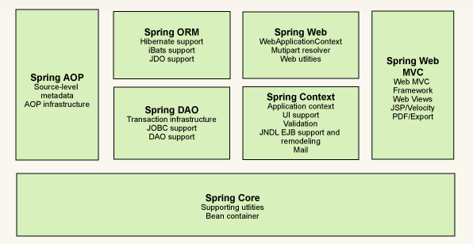
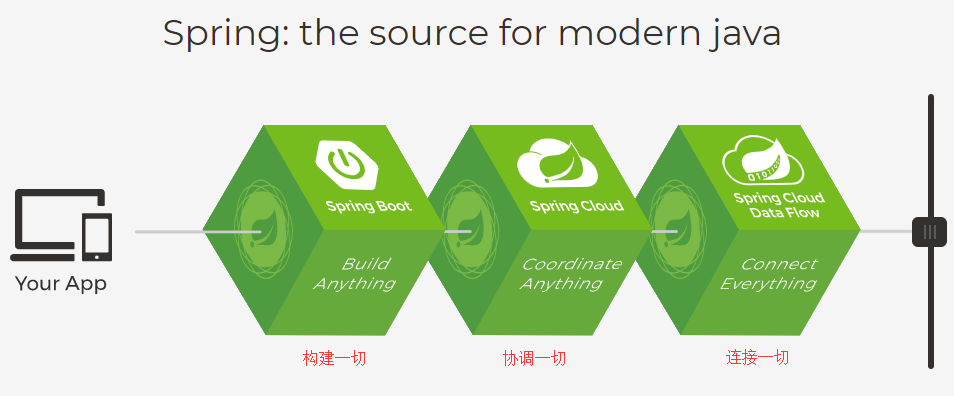
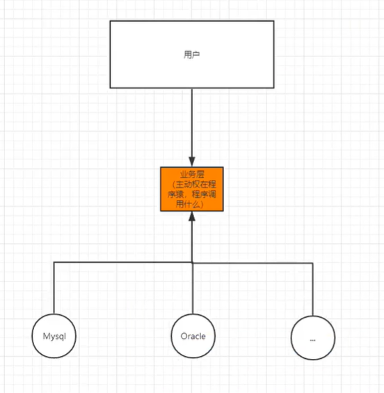
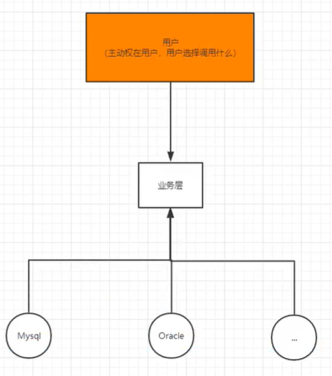
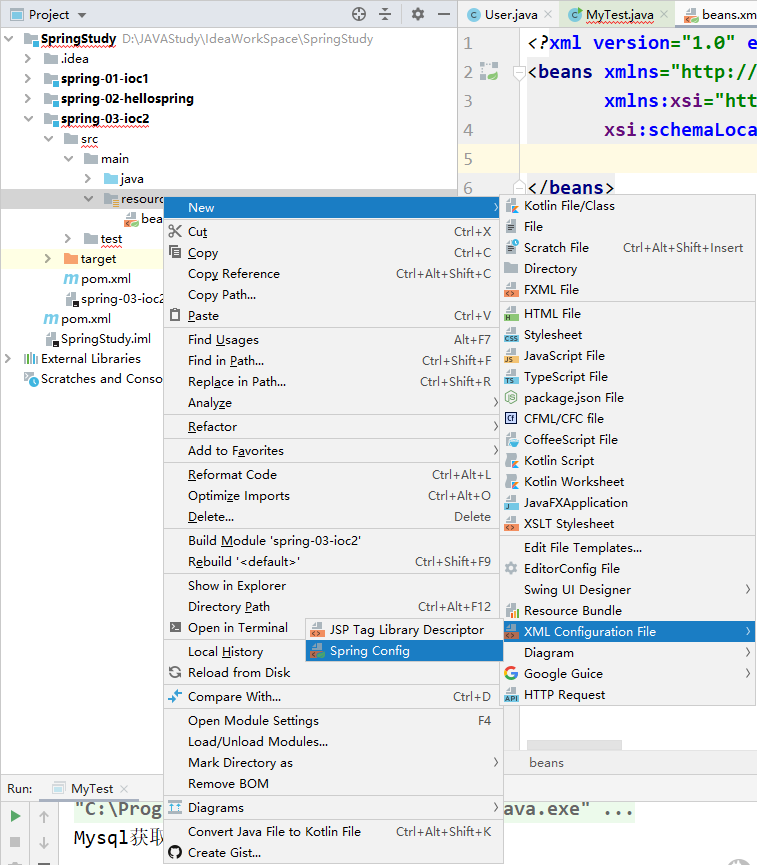
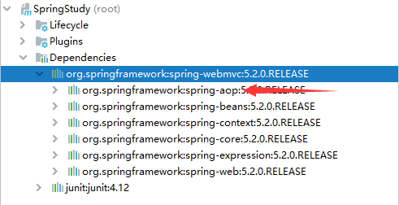
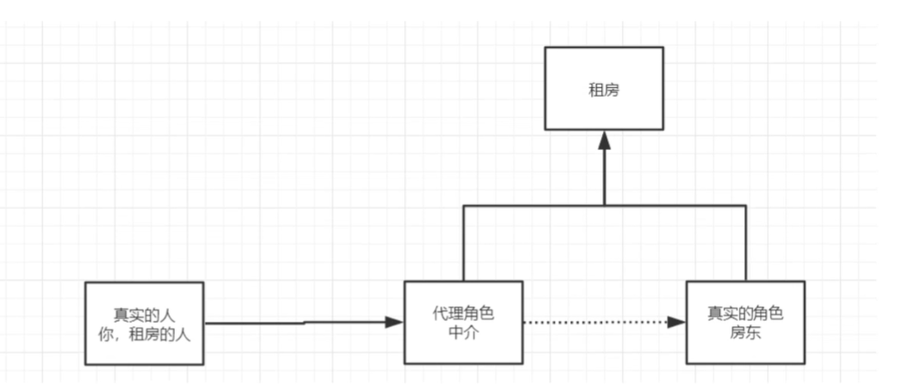
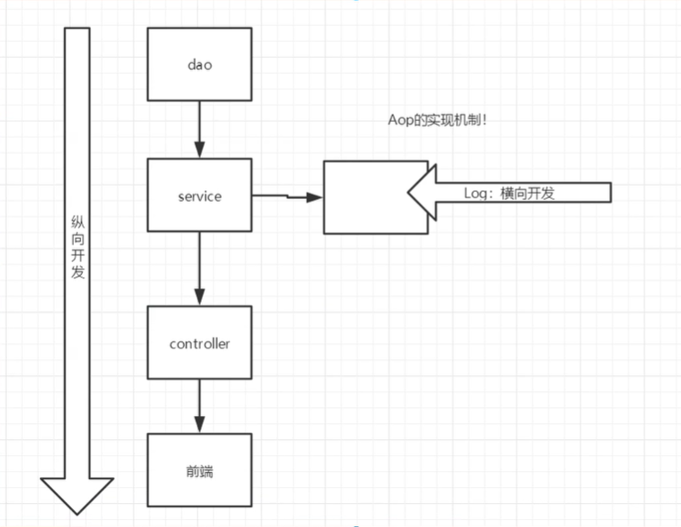
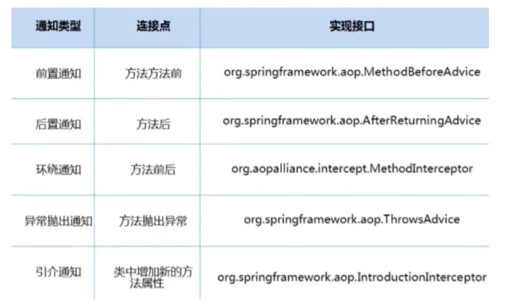

## 1、Spring

### 1.1 简介

- Spring：春天---->给软件行业带来了春天！
- 2002，首次推出了Spring框架的雏形：interface21框架！
- Spring框架即以interface21框架为基础，经过重新设计，并不断丰富内涵，于2004年3月24日，发布了1.0正式版。
- **Rod Johnson**，Spring Framework创始人，著名作者。很难想象其学历，真的让好多人大吃一惊，他是悉尼大学的博士，然而他的专业不是计算机，而是音乐学。
- spring理念：使现有的技术更加容易使用，本身是一个大杂烩，整合了现有的技术框架。
- **SSH：Struct2+Spring+Hibernate!**
- **SSM：SpringMVC+Spring+Mybatis!**

​	

官网：https://spring.io/projects/spring-framework#overview

官方下载地址：https://repo.spring.io/release/org/springframework/spring/

Github：https://github.com/spring-projects/spring-framework

Maven仓库：导入webmvc包会自动导入相关依赖；jdbc用于和Mybatis整合。

```xml
<!-- https://mvnrepository.com/artifact/org.springframework/spring-webmvc -->
<dependency>
    <groupId>org.springframework</groupId>
    <artifactId>spring-webmvc</artifactId>
    <version>5.2.0.RELEASE</version>
</dependency>
<!-- https://mvnrepository.com/artifact/org.springframework/spring-jdbc -->
<dependency>
    <groupId>org.springframework</groupId>
    <artifactId>spring-jdbc</artifactId>
    <version>5.2.0.RELEASE</version>
</dependency>
```


### 1.2 优点

- Spring是一个开源的免费的框架（容器）！

- Spring是一个轻量级的、非入侵式的框架！

- 控制反转（IOC）、面向切面编程（AOP）！

- 支持事务的处理，对框架整合的支持！

  ==**总结一句话：Spring就是一个轻量级的控制反转（IOC）和面向切面编程的框架！**==


### 1.3 组成




###   1.4 拓展

在Spring的官网有这个介绍：现代化的java开发！说白了就是基于Spring的开发！



- Spring Boot
  - 一个快速开发的脚手架。
  - 基于Spring Boot可以快速的开发单个微服务。
  - 约定大于配置！
- Spring Cloud
  - SpringCloud是基于SpringBoot实现的。

因为现在大多数公司都在使用SpringBoot进行快速开发，学习SpringBoot的前提，需要完全掌握Spring以及SpringMVC！承上启下的作用。

**弊端：发展了太久之后，违背了原来的理念！配置十分繁琐，人称：“配置地狱”。**


## 2、 IOC理论推导

1.UserDao接口

2.UserDaoImpl实现类

3.UserService业务接口

4.UserServiceImpl业务实现类

在我们之前的业务中，用户的需求可能会影响我们原来的代码，我们需要根据用户的需求去修改源代码!如果程序代码量十分大，修改一次的成本代价十分昂贵！


我们使用一个Set接口实现，已经发生了革命性的变化！

```java
private UserDao userDao;

//利用set进行动态实现值的注入！
public void setUserDao(UserDao userDao){
    this.userDao = userDao;
}
```

- 之前，程序是主动创建对象！控制权在程序员手上！
- 使用了set注入后，程序不再具有主动性，而是变成了被动的接收对象！


这种思想，从本质上解决了问题，我们程序员不用再去管理对象的创建了。系统的耦合性大大降低，可以更加专注在业务的实现上。这是IOC的原型！





### IOC本质

**控制反转IOC（Inversion of Control），是一种设计思想，DI（依赖注入）是实现IOC的一种方法，**也有人认为DI是IoC的另一种说法。没有IoC的程序中，我们使用面向对象编程，对象的创建与对象间的依赖关系完全硬编码在程序中，对象的创建由程序自己控制，控制反转后将对象的创建转移给第三方，个人认为所谓控制反转就是：获得依赖对象的方式反转了。

采用XML方式配置Bean的时候，Bean的定义信息是和实现分离的，而采用注解的方式可以把两者合为一体，Bean的定义信息直接以注解的形式定义在实现类中，从而达到了零配置的目的。

**控制反转是一种通过描述（XML或注解）并通过第三方去生产或获取特定对象的方式。在Spring中实现控制反转的是IoC容器，其实现方式是依赖注入（Dependency Injection,DI）**。


## 3、 Hello Spring

beans.xml官网配置文件：

```xml
<?xml version="1.0" encoding="UTF-8"?>
<beans xmlns="http://www.springframework.org/schema/beans"
       xmlns:xsi="http://www.w3.org/2001/XMLSchema-instance"
       xsi:schemaLocation="http://www.springframework.org/schema/beans
        https://www.springframework.org/schema/beans/spring-beans.xsd">

</beans>
```

bean对象添加：

```xml
<bean id="mysqlImpl" class="com.kuang.dao.UserDaoMysqlImpl"></bean>
<bean id="oracleImpl" class="com.kuang.dao.UserDaoOracleImpl"></bean>

<bean id="UserServiceImpl" class="com.kuang.service.UserServiceImpl">
    <!--
        ref：引用Spring容器中已经创建好的对象
        value：具体的值，基本数据类型
        -->
    <property name="userDao" ref="mysqlImpl"></property>
</bean>
```

Test方法：

```java
//解析beans.xml文件，生成管理相应的Bean对象
ApplicationContext context = new ClassPathXmlApplicationContext("beans.xml");
//getBean:参数即为spring配置文件中bean的id
Hello hello = (Hello) context.getBean("hello");
System.out.println(hello.toString());
```

### **思考问题**？

- Hello对象是谁创建的？

  hello对象是由Spring创建的。

- Hello对象的属性是怎么设置的？

  hello对象的属性是由Spring容器设置的。

这个过程就叫做控制反转：

控制：谁来控制对象的创建，传统应用程序的对象是由程序本身控制创建的，使用Spring后，对象是由Spring来创建的。

反转：程序本身不创建对象，而变成被动的接收对象。

依赖注入：就是利用set方法来进行注入。

IoC是一种编程思想，由主动的编程编程被动的接收。

可以通过new ClassPathXmlApplicationContext去浏览一下底层源码。

**OK，到了现在，我们彻底不用在程序中去改动了，要实现不同的操作，只需要在xml配置文件中进行修改，所谓的IoC，一句话搞定：对象由Spring来创建，管理，装配！**


IDEA快捷创建beans.xml文件，自动导入spring配置信息：




## 4、 IoC创建对象的方式

1. 使用无参构造创建对象，默认方式！

2. 假设我们要使用有参构造创建对象。

   1.下标赋值。

   ```xml
   <!--第一种，下标赋值！-->
   <bean id="user" class="com.kuang.pojo.User">
       <constructor-arg index="0" value="憨批" />
   </bean>
   ```

   2.类型赋值。

   ```xml
   <!--第二种，通过类型创建，不建议使用，重复类型难以分辨-->
   <bean id="user" class="com.kuang.pojo.User">
       <constructor-arg type="java.lang.String" value="大憨批" />
   </bean>
   ```

   3.参数名赋值。

   ```xml
   <!--第三种，直接通过参数名来设置-->
   <bean id="user" class="com.kuang.pojo.User">
       <constructor-arg name="name" value="臭憨批" />
   </bean>
   ```


总结：在配置文件加载的时候，容器中管理的对象就已经初始化了！


## 5、 Spring配置

### 5.1 别名

```xml
<!--别名，如果添加了别名，我们也可以使用别名获取到-->
<alias name="user" alias="userNew"></alias>
```

### 5.2 Bean的配置

```xml
<!--
    id:bean的唯一标识符，相当于我们学的对象名；
    class：bean对象所对应的全限定名：包名+类名；
    name：也是别名，可以同时取多个别名，逗号分割
-->
<bean id="userT" class="com.kuang.pojo.UserT" name="user2,u2">
</bean>
```

### 5.3 import

这个import，一般用于团队开发使用，他可以将多个配置文件，导入合并为一个。

假设，现在项目中有多个人开发，这三个人负责不同的类开发，不同的类需要注册在不同的bean中，我们可以利用import将所有人的beans.xml合并为一个总的！

- 张三
- 李四
- 王五
- applicationContext.xml

```xml
<import resource="beans.xml"/>
<import resource="beans2.xml"/>
<import resource="beans3.xml"/>
```

使用的时候，直接使用总的配置就可以了。


## 6、 依赖注入

### 6.1 构造器注入

之前已经介绍过。

### 6.2 Set方式注入【重点】

- 依赖注入：Set注入！
  - 依赖：bean对象的创建依赖于容器！
  - 注入：bean对象中的所有属性，由容器来注入！

【环境搭建】

1. 复杂类型

   ```java
   public class Address {
       private String address;
   
       public String getAddress() {
           return address;
       }
   
       public void setAddress(String address) {
           this.address = address;
       }
   }
   ```

2. 真实测试对象

   ```java
   public class Student {
       private String name;
       private Address address;
       private String[] books;
       private List<String> hobbies;
       private Map<String,String> card;
       private Set<String> games;
       private String wife;
       private Properties info;
   }
   ```

   3. beans.xml

      ```xml
      <?xml version="1.0" encoding="UTF-8"?>
      <beans xmlns="http://www.springframework.org/schema/beans"
             xmlns:xsi="http://www.w3.org/2001/XMLSchema-instance"
             xsi:schemaLocation="http://www.springframework.org/schema/beans http://www.springframework.org/schema/beans/spring-beans.xsd">
          <bean id="student" class="com.kuang.pojo.Student">
              <!--第一种，普通值注入-->
              <property name="name" value="憨批"/>
          </bean>
      </beans>
      ```

   4. 测试类

      ```java
      public class MyTest {
          public static void main(String[] args) {
              ApplicationContext context = new ClassPathXmlApplicationContext("beans.xml");
              Student student = (Student) context.getBean("student");
              System.out.println(student.getName());
          }
      }
      ```


==**完善注入：**==

```xml
<?xml version="1.0" encoding="UTF-8"?>
<beans xmlns="http://www.springframework.org/schema/beans"
       xmlns:xsi="http://www.w3.org/2001/XMLSchema-instance"
       xsi:schemaLocation="http://www.springframework.org/schema/beans http://www.springframework.org/schema/beans/spring-beans.xsd">

    <bean id="address" class="com.kuang.pojo.Address"/>

    <bean id="student" class="com.kuang.pojo.Student">
        <!--第一种，普通值注入，value-->
        <property name="name" value="憨批"/>
        <!--第二种，Bean注入，ref-->
        <property name="address" ref="address"/>
        <!--数组注入-->
        <property name="books">
            <array>
                <value>红楼梦</value>
                <value>西游记</value>
                <value>水浒传</value>
                <value>三国演义</value>
            </array>
        </property>
        <!--List注入-->
        <property name="hobbies">
            <list>
                <value>听歌</value>
                <value>敲代码</value>
                <value>看电影</value>
            </list>
        </property>
        <!--Map-->
        <property name="card">
            <map>
                <entry key="身份证" value="1555555555"/>
                <entry key="银行卡" value="5555555555"/>
            </map>
        </property>
        <!--Set-->
        <property name="games">
            <set>
                <value>lol</value>
                <value>wow</value>
            </set>
        </property>
        <!--null-->
        <property name="wife">
            <null/>
        </property>
        <!--Properties-->
        <property name="info">
            <props>
                <prop key="driver">com.mysql.jdbc.Driver</prop>
                <prop key="url">jdbc:mysql://localhost:3306/news</prop>
                <prop key="root">root</prop>
                <prop key="password">123456</prop>
            </props>
        </property>

    </bean>

</beans>
```

### 6.3 拓展方式注入

我们可以使用c和p命令空间进行注入：

使用：

```xml
<?xml version="1.0" encoding="UTF-8"?>
<beans xmlns="http://www.springframework.org/schema/beans"
       xmlns:p="http://www.springframework.org/schema/p"
       xmlns:c="http://www.springframework.org/schema/c"
       xmlns:xsi="http://www.w3.org/2001/XMLSchema-instance"
       xsi:schemaLocation="http://www.springframework.org/schema/beans http://www.springframework.org/schema/beans/spring-beans.xsd">

    <!--p命名空间注入，可以直接注入属性的值：property-->
    <bean id="user" class="com.kuang.pojo.User" p:name="憨批" p:age="18"/>

    <!--c命名空间注入，通过构造器注入：construct-args-->
    <bean id="user2" class="com.kuang.pojo.User" c:age="18" c:name="憨批"/>

</beans>
```

测试:

```java
@Test
public void test2(){
    ApplicationContext context = new ClassPathXmlApplicationContext("userBeans.xml");
    User user = context.getBean("user2", User.class);
    System.out.println(user);
}
```

注意点：p和c命名空间不能直接使用，需要导入xml约束！

```xml
xmlns:p="http://www.springframework.org/schema/p"
xmlns:c="http://www.springframework.org/schema/c"
```


### 6.4 bean的作用域

###### 

1. 代理模式（Spring默认机制）：get到的都是同一个对象！

   ```xml
   <bean id="user2" class="com.kuang.pojo.User" c:age="18" c:name="憨批" scope="singleton"/>
   ```

2. 原型模式：每次从容器中get的时候，都会产生一个新的对象！

	```xml
	<bean id="user2" class="com.kuang.pojo.User" c:age="18" c:name="憨批" scope="prototype"/>
	```

3. 其余的request、session、application、这些个只能在web开发中使用。


## 7、 Bean的自动装配

- 自动装配是Spring满足bean依赖的一种方式！
- Spring会在上下文中自动寻找，并自动给bean装配属性！


在Spring中有三种装配的方式：

1. 在xml中显式配置；
2. 在java中显式配置；
3. 隐式的自动装配bean


### 7.1 测试

环境搭建：一个人有两个宠物！

### 7.2 ByName自动装配

```xml
<!--
    byName:会自动在容器上下文中查找和自己对象set方法后面的值对应的beanid！
-->
<bean id="people" class="com.kuang.pojo.People" autowire="byName">
    <property name="name" value="憨批"/>
</bean>
```

### 7.3 ByType自动装配

```xml
<!--
    byType:会自动在容器上下文中查找，和自己对象属性类型相同的bean！必须保证类型全局唯一。
-->
<bean id="people" class="com.kuang.pojo.People" autowire="byType">
    <property name="name" value="憨批"/>
</bean>
```

小结：

- byName的时候，需要保证所有bean的id唯一，并且这个bean需要和自动注入的属性的set方法的值一致！
- byType的时候，需要保证所有bean的class唯一，并且这个bean需要和自动注入的属性的类型一致！

### 7.4 使用注解实现自动装配

jdk1.5支持注解，Spring2.5开始支持注解。

要使用注解须知：

1. 导入约束：context约束。

2. 配置注解的支持：<context:annot-config/>

   ```xml
   <?xml version="1.0" encoding="UTF-8"?>
   <beans xmlns="http://www.springframework.org/schema/beans"
       xmlns:xsi="http://www.w3.org/2001/XMLSchema-instance"
       xmlns:context="http://www.springframework.org/schema/context"
       xsi:schemaLocation="http://www.springframework.org/schema/beans
           https://www.springframework.org/schema/beans/spring-beans.xsd
           http://www.springframework.org/schema/context
           https://www.springframework.org/schema/context/spring-context.xsd">
   
       <context:annotation-config/>
   
   </beans>
   ```

**@Autowired**

直接在属性上使用即可！也可以在set方式上使用！

使用Autowired我们可以不用编写Set方法了，前提是你这个自动装配的属性在IoC（Spring）容器中存在，且符合名字byName！

科普：

```java
@Nullable	字段标记了这个注解，说明这个字段可以为null
    public People(@Nullable String name){
    this.name = name;
}
```

```java
public @interface Autowired {
    boolean required() default true;
}
```

测试代码：

```java
public class People {
    //如果显式定义了Autowired的required属性为false，说明这个对象可以为null，否则不允许为空
    @Autowired(required = false)
    private Dog dog;
    @Autowired
    private Cat cat;
    private String name;
}
```

如果@Autowired自动装配的环境比较复杂，自动装配无法通过一个注解@Autowired完成的时候，我们可以使用@Qualifier(value="xxx")去配置@Autowired的使用，指定一个唯一的bean对象注入！

```java
public class People {
    @Autowired
    @Qualifier(value="dog11")
    private Dog dog;
    @Autowired
	@Qualifier(value="cat11")
    private Cat cat;
    private String name;
}
```

**@Resource注解**

```java
public class People {
    @Resource(name = "cat2")
    private Cat cat;
}
```

小结：

@Resource和@Autowired的区别：

- 都是用来自动装配的，都可以放在属性字段上；
- @Autowired通过byType的方式实现，而且必须要求这个对象存在！【常用】
- @Resource默认通过byName的方式实现，如果找不到名字，则通过byType实现！如果两个都找不到的情况下，就报错！

- 执行顺序不同：@Autowired通过byType的方式实现，@Resource默认通过byName的方式实现。


## 8、 使用注解开发

在spring4之后，要使用注解开发，必须要保证aop的包导入了。



使用注解需要导入context约束，增加注解的支持！

```xml
<!--指定要扫描的包，这个包下的注解会生效-->
<context:component-scan base-package="com.kuang.pojo"/>
```

1. bean

2. 属性如何注入

   ```java
   //等价于<bean id="user" class="com.kuang.pojo.User"/>
   //@Component 组件
   @Component
   public class User {
       //相当于<property name="name" value="小憨批"/>
       public String name;
       @Value("小憨批")
       public void setName(String name){
           this.name = name;
       }
   }
   ```

3. 衍生的注解

   @Component有几个衍生注解，我们在web开发中，会按照mvc三层架构分层！

   - dao【@Repository】
   - service【@Service】
   - controller【@Controller】

   这四个注解功能都是一样的，都是代表将某个类注册到Spring中，装配Bean！

4. 自动装配

   ```
   -@Autowired:自动装配通过类型，名字
   	如果Autowired不能唯一自动装配上属性，则需要通过@Qualifier(value="xxx")
   -@Nullable:字段标记了这个注解，说明这个字段可以为null
   -@Resource:自动装配通过名字，类型
   ```

5. 作用域

   ```java
   @Scope("singleton")
   public class User {
       //相当于<property name="name" value="小憨批"/>
       public String name;
       @Value("小憨批")
       public void setName(String name){
           this.name = name;
       }
   }
   ```

6. 小结

   xml与注解：

   - xml更加万能，适用于任何场合！维护简单方便。
   - 注解，不是自己的类使用不了，维护相对复杂！

   xml与注解最佳实践：

   - xml用来管理bean；
   - 注解只负责完成属性的注入；
   - 我们在使用的过程中，只需要注意一个问题：必须让注解生效，就需要开启注解的支持。

   ```xml
    <!--指定要扫描的包，这个包下的注解会生效-->
   <context:component-scan base-package="com.kuang"/>
   <context:annotation-config/>
   ```


## 9、 使用java的方式配置Spring

我们现在要完全不适用Spring的xml配置了，全权交给java来做！

javaConfig是Spring的一个子项目，在Spring4之后，它成为了一个核心功能。

实体类：

```java
@Component
public class User {
    private String name;

    public String getName() {
        return name;
    }

    @Value("小笨蛋")
    public void setName(String name) {
        this.name = name;
    }

    @Override
    public String toString() {
        return "User{" +
                "name='" + name + '\'' +
                '}';
    }
}
```


```java
import com.kuang.pojo.User;
import org.springframework.context.annotation.Bean;
import org.springframework.context.annotation.ComponentScan;
import org.springframework.context.annotation.Configuration;
import org.springframework.context.annotation.Import;

//这个也会被Spring容器托管，注册到容器中，因为本来就是一个@Component
//@Configuration代表这是一个配置类，就和我们之前看的beans.xml
@Configuration
@ComponentScan("com.kuang.pojo")
@Import(KuangConfig2.class )
public class KuangConfig {
    //注册一个bean，就相当于我们之前写的一个bean标签
    //这个方法的名字，就相当于bean标签中的id属性
    //这个方法的返回值，就相当于bean标签中的class属性
    @Bean
    public User getUser(){
        return new User();//就是返回要注入到bean的对象
    }
}
```

测试类：

```java
public class MyTest {
    public static void main(String[] args) {
        //如果完全使用了配置类方式去做，我们就只能通过AnnotationConfig上下文来获取容器，通过配置类的class对象加载！
        ApplicationContext context = new AnnotationConfigApplicationContext(KuangConfig.class);
        User getUser = (User) context.getBean("getUser");
        System.out.println(getUser.getName());
    }
}
```

这种纯java的配置方式，在SpringBoot中随处可见！


## 10、 代理模式

为什么要学习代理模式？因为这就是SpringAOP的底层！【SpringAOP 和 SpringMVC  面试必问】

代理模式的分类：

- 静态代理
- 动态代理




### 10.1 静态代理

角色分析：

- 抽象角色：一般会使用接口或者抽象类来解决
- 真实角色：被代理的角色
- 代理角色：代理真是角色，代理真实角色后，我们一般会做一些附属操作。
- 客户：访问代理对象的人！

代码步骤：

1. 接口

   ```java
   //租房
   public interface Rent {
       public void rent();
   }
   ```

2. 真实角色

   ```java
   //房东
   public class Host implements Rent {
       public void rent(){
           System.out.println("房东要出租房子！");
       }
   }
   ```

3. 代理角色

   ```java
   public class Proxy implements Rent {
       private Host host;
   
       public Proxy() {
       }
       public Proxy(Host host) {
           this.host = host;
       }
   
       public void rent(){
           seeHouse();
           host.rent();
           hetong();
           fee();
       }
       //看房
       public void seeHouse(){
           System.out.println("中介带你看房");
       }
       //签合同
       public void hetong(){
           System.out.println("签合同");
       }
       //收费
       public void fee(){
           System.out.println("收取中介费用");
       }
   }
   ```

4. 客户端访问

   ```java
   public class Client {
       public static void main(String[] args) {
           //房东要租房子
           Host host = new Host();
           //代理，中介帮房东租房子，但是呢？代理角色一般会有一些附属操作！
           Proxy proxy = new Proxy(host);
           proxy.rent();
       }
   }
   ```


代理模式的好处：

- 可以使真实角色的操作更加纯粹！不用去关注一些公共的业务
- 公共也就交给代理角色！实现了业务的分工！
- 公共业务发生扩展的时候，方便集中管理！

缺点：

- 一个真实角色就会产生一个代理角色，代码量会翻倍，开发效率会变低


### 10.2 加深理解

代码：对应08-demo02

聊聊AOP




### 10.3 动态代理

- 动态代理和静态代理角色一样
- 动态代理的代理类是动态生成的，不是我们直接写好的。
- 动态代理分为两大类：基于接口的动态代理，基于类的动态代理
  - 基于接口——JDK动态代理
  - 基于类：cglib
  - java字节码实现：javasisit


需要了解两个类：Proxy：代理；InvocationHandler：调用处理程序


动态代理的好处：

- 可以使真实角色的操作更加纯粹！不用去关注一些公共的业务
- 公共也就交给代理角色！实现了业务的分工！
- 公共业务发生扩展的时候，方便集中管理！
- 一个动态代理类代理类代理的是一个接口，一般就是对应的一类业务
- 一个动态代理类可以代理多个类，只要是实现了同一个接口即可！


## 11、 AOP

### 11.1 什么是AOP

AOP（Aspect Oriented Programming）意为：面向切面编程，通过预编译方式和运行期动态代理实现程序功能的统一维护的一种技术。AOP是OOP的延续，是软件开发中的一个热点，也是Spring框架中的一个重要内容，是函数式编程的一种衍生泛型，利用AOP可以对业务逻辑的各个部分进行隔离，从而使得业务逻辑各部分之间的耦合度降低，提高程序的可重用性，同时提高了开发的频率。


### 11.2 AOP在Spring中的作用

==提供声明式事务；允许用户自定义切面==

- 横切关注点：跨越应用程序多个模块的方法或功能。即是，与我们业务逻辑无关的，但是我们需要关注的部分，就是横切关注点，如日志、安全、缓存、事务等等……
- 切面（ASPECT）：横切关注点被模块化的特殊对象，即是一个类。
- 通知（Advice）：切面必须要完成的工作，即是类中的一个方法。
- 目标（Target）：被通知对象。
- 代理（Proxy）：向目标对象应用通知之后创建的对象。
- 切入点（PointCut）：切面通知执行的“地点”的定义。
- 连接点（jointPoint）：与切入点匹配的执行点。


SpringAOP中，通过Advice定义横切逻辑，Spring中支持5种类型的Advice：



即AOP在不改变原有代码的情况下，去增加新的功能。


### 11.3 使用Spring实现AOP

【重点】使用AOP织入，需要导入一个依赖包。

```xml
<!-- https://mvnrepository.com/artifact/org.aspectj/aspectjweaver -->
<dependency>
    <groupId>org.aspectj</groupId>
    <artifactId>aspectjweaver</artifactId>
    <version>1.9.5</version>
</dependency>
```


方式一：使用Spring的API接口【主要SpringAPI接口实现】

方式二：自定义来实现AOP【主要是切面定义】

方式三：使用注解实现


## 12、 整合Mybatis

步骤：

1. 导入相关jar包
   - junit
   - Mybatis
   - mysql数据库
   - spring相关的
   - aop织入
   - mybatis-spring【new知识点】
2. 编写配置文件
3. 测试


### 12.1 回忆mybatis

1. 编写实体类
2. 编写核心配置文件
3. 编写接口
4. 编写Mapper.xml
5. 测试


### 12.2 Mybatis-Spring

1. 编写数据源配置
2. sqlSessionFactory
3. sqlSessionTemplate
4. 需要给接口加实现类
5. 将自己写的实现类，注入到Spring中
6. 测试


## 13、 声明式事务

### 13.1 回顾事务

- 把一组业务当成一个业务来做：要么都成功，要么都失败。
- 事务在项目开发中，十分的重要，涉及到数据的一致性问题，不能马虎。
- 确保完整性和一致性。


事务ADID原则：

- 原子性
- 一致性
- 隔离性
  - 多个业务可能操作同一个资源，防止数据损坏
- 持久性
  - 事务一旦提交，无论系统发生什么问题，结果都不会再被影响，被持久化的写到存储器中。


13.2 Spring中的事务管理

- 声明式事务：AOP
- 编程式事务：需要在代码中，进行事务的管理


思考：

为什么需要事务？

- 如果不配置事务，可能存在数据提交不一致的情况
- 如果我们不在Spring中去配置声明式事务，我们就需要在代码中手动配置事务
- 事务在项目的开发中十分重要，涉及到数据的一致性和完整性问题，不容马虎


